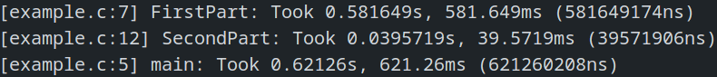

# LittleProfiler

This is a small header-only profiler that measures execution time of code.

## How to use it

Just copy and paste the [`profiler.h`](profiler.h) header file in your project
and you're ready to go!

### Profiling a function
```c
void func(void)
{
    PROFILE_FUNC();
    // ...
    PROFILE_END();
}
```

### Profiling a section
```c
void func(void)
{
    // ...
    PROFILE_BEGIN("my_section");
    // ...
    PROFILE_END();
    // ...
}
```

## Example

An example of the header is available [here](example.c).

To compile an run the example, open a terminal and type :
```
gcc -oexample example.c -O0 -std=c99 -W -Wall -Wextra -Wpedantic
./example
```

## Output


